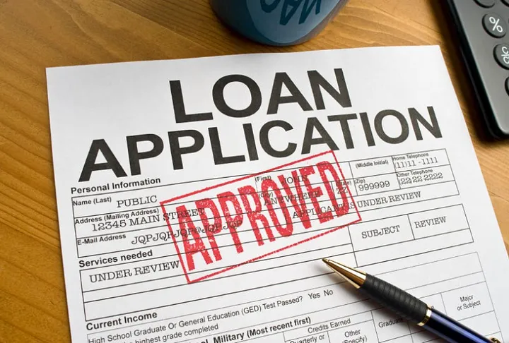

# Cientista de Dados
Tenho experiência acadêmica em manipulação de grandes conjuntos de dados com SQL e Python, e na criação de dashboards úteis para o negócio com Power BI. Tenho capacidade de analisar dados brutos e traduzi-los em informações úteis para o negócio por meio de técnicas da área e estatística, e também consigo fazer análises preditivas por meio de Machine Learning.

Também tenho experiência prática com versionamento de códigos (Git), conteinerização (Docker) e análise de dados em Nuvem (AWS e Google Cloud), além de Storytelling com dados e metodologias ágeis.

Também tenho conhecimentos em bibliotecas como FastAPI para criar APIs, LangChain para gerar aplicações que utilizam modelos de linguagem natural e PySpark para manipulação de grandes conjuntos de dados.

## Projetos
### Previsão de Inadimplência em Empréstimos
[Publicação](https://medium.com/@patricksilvalessa5/projeto-previsão-de-inadimplência-089ab3141c13)

Neste projeto, conduzi todas as etapas de análise de dados, desde a exploração inicial e limpeza de uma base com informações de clientes inadimplentes até o desenvolvimento e implementação de modelos preditivos. Utilizei técnicas de Machine Learning para prever inadimplência em empréstimos, gerando insights valiosos para apoiar a tomada de decisões da empresa. Possuo uma publicação no Medium com todo o processo do projeto explicado e o notebook do projeto desenvolvido disponível no GitHub.
